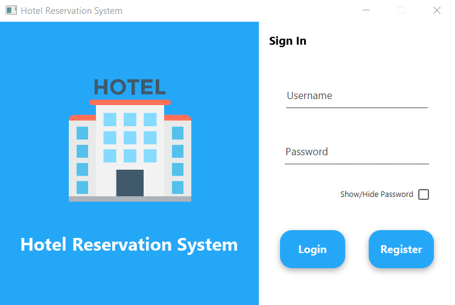
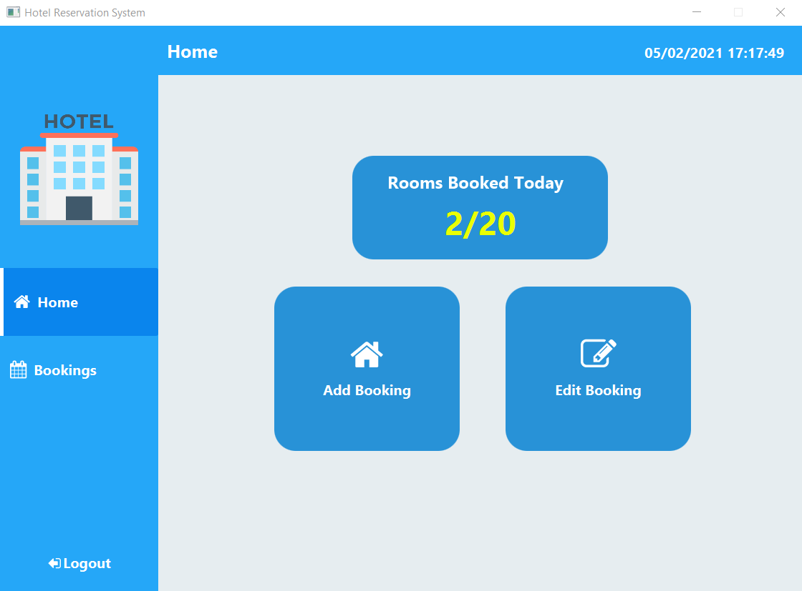
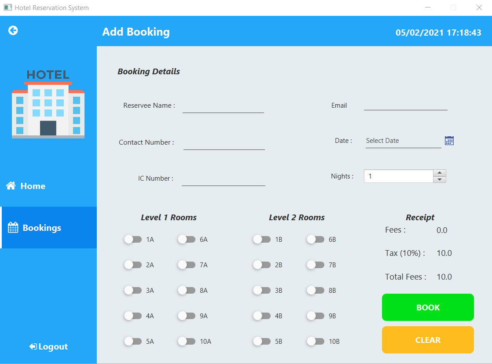
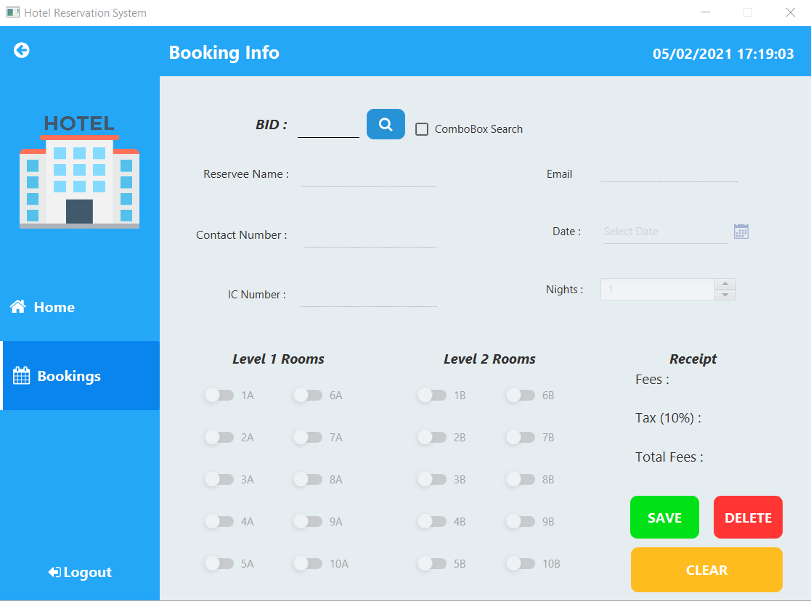

# Java Assignment - Hotel Booking Reservation System
A hotel booking system built on:
*Java 8
*[Jfeonix for Java 8](https://github.com/sshahine/JFoenix)
*[SceneBuilder for Java 8](https://gluonhq.com/products/scene-builder/)
*{fontawesomefx}(https://bitbucket.org/Jerady/fontawesomefx/downloads/fontawesomefx-8.9.jar)

## Features
*Sign Up 
*Sign In
*Search Booking
*Create Booking
*Delete Booking
*Displays Total Rooms Booked for Current Date

## Overview





## To Get Started
To check the booking details and staff login credentials locate the .Data folder:
```
/JP Assignment/Java Assignment/.Data
```
